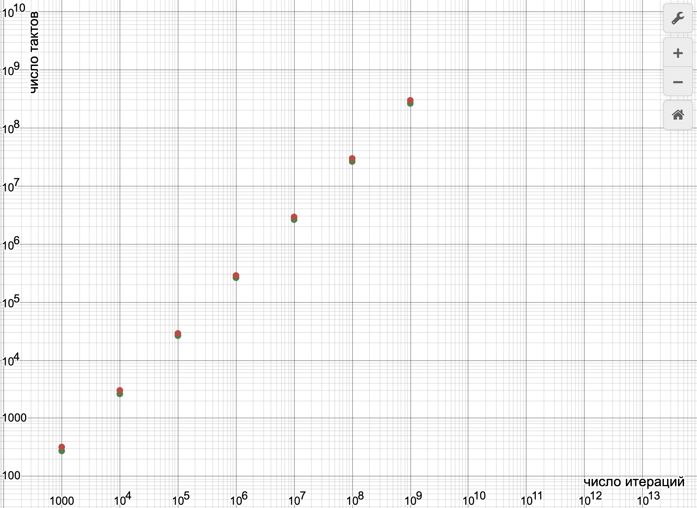

Сравнение скорости работы кольцевого двусвязного списка на массивах и классического списка
===

Для сравнения был отключен верификатор у обоих списков, а также выключен ```debug_mode``` и добавлена оптимизация ```-o3```.

Замеры времени происходили с помощью вызова функции ```clock()``` в начале и в конце выполняемой серии операций. Серии операций состояли из последовательных вставок и удалений в количестве от $10^3$ до $10^9$ раз.

Результаты измерений представлены в следующей таблице:

|    n   	|    ```list```   	| ```vlist```     	|
|:------:	|:---------:	|-----------	|
| $10^3$ 	| 275       	| 321       	|
| $10^4$ 	| 2635      	| 3028      	|
| $10^5$ 	| 26476     	| 28944     	|
| $10^6$ 	| 263226    	| 287333    	|
| $10^7$ 	| 2633728   	| 2926823   	|
| $10^8$ 	| 26341577  	| 29738208  	|
| $10^9$ 	| 263364431 	| 297392612 	|

В таблице указана зависимость числа тактов процессора от количества итераций.

График построенный по данным из таблицы (зеленые точки - кольцевой список на массивах, красные - классический список):



Разница в длительности работы двух списков невелика, но тем не менее кольцеовй список быстрее.

Если сравнивать число тактов на итерацию, то кольцевой список эффективнее на 12%.