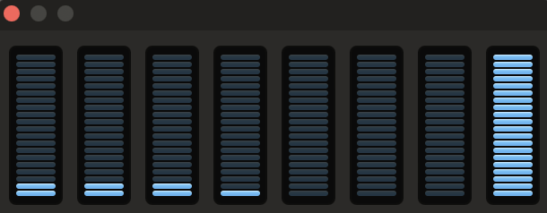
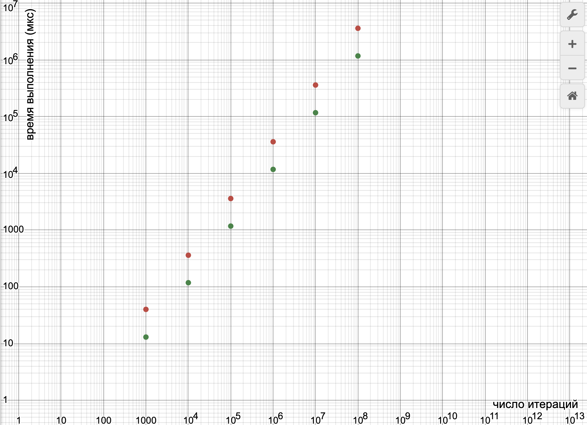

Сравнение скорости работы кольцевого двусвязного списка на массивах и классического списка
===

Данные измерения проводились на Macbook Air с процессором Apple M1, с 16 GB оперативной памяти и операционной системой Sonoma 14.4.

Для сравнения был отключен верификатор у обоих списков, а также выключен ```debug_mode```, и добавлена оптимизация ```-o3```.

Общий список флагов выглядел так:
```
-O3 -DNDEBUG -fomit-frame-pointer \
-Wall -Wextra -Werror \
-Wcast-align -Wcast-qual -Wconversion \
-Wfloat-equal -Wformat-security -Wformat=2 \
-Wnull-dereference -Winit-self \
-Wshadow -Wstrict-overflow=2 \
-Wswitch-default -Wswitch-enum \
-Wundef -Wunused -Wvla
```

Замеры времени происходили с помощью вызова функции ```getrusage``` из библиотеки ```<sys/resource.h>```в начале и в конце выполняемой серии операций. Серии операций состояли из последовательных вставок и удалений в количестве от $10^3$ до $10^8$ раз.

Дополнительно был выставлен максимальный приоритет задачи (QoS), чтобы процесс выполнялся на "ядрах производительности" (Perfomance Cores). Приоритет выставлялся с помощью команды ``` pthread_set_qos_class_self_np (QOS_CLASS_USER_INTERACTIVE, 0);``` из библиотеки ```pthread.h```.

Время выполнения вычислялось следующим образом:

```
...

#include <sys/resource.h>
struct rusage usage;

...

for (int i = 3; i < 9; i++)
{
    getrusage(RUSAGE_SELF, &usage);
    struct timeval begin = usage.ru_utime;
    long long start_time = begin.tv_usec + 1000000 * begin.tv_sec;

    ...

    // main loop here

    ...

    getrusage(RUSAGE_SELF, &usage);
    struct timeval end = usage.ru_utime;
    long long finish_time = end.tv_usec + 1000000 * end.tv_sec;
    
    printf("LIST: number of iterations = 10^%d, delta = %llu\n\n", i, finish_time - start_time);
}

```

Подобным образом измерялось время работы кольцевого списка и классического списка при $10^3$ - $10^8$ итерациях по 4 раза за запуск.

В каждом повторении теста сначала измерялось время работы классического списка, потом кольцевого.

На протяжении всего эксперимента работа сторонних приложений была сведена к минимуму, выполнение программы выполнялось на единственном ядре 8-ядерного процессора Apple-M1, однако, вследствие встроенных оптимизаций, само ядро, на котором выполнялась задача, менялось.



Результаты измерений 2 - 4 повторения теста были практически одинаковыми и представлены в следующей таблице:

|    n   	|    ```list```   	| ```vlist```     	|
|:------:	|:---------:	|-----------	|
| $10^3$ 	| 13       	| 40       	|
| $10^4$ 	| 118      	| 360      	|
| $10^5$ 	| 1173     	| 3588     	|
| $10^6$ 	| 11712    	| 35909    	|
| $10^7$ 	| 116831   	| 358848   	|
| $10^8$ 	| 1168813  	| 3588408  	|


В таблице указана зависимость времени выполнения (в мкс) от количества итераций.

График построенный по данным из таблицы (зеленые точки - кольцевой список на массивах, красные - классический список):



Разница в длительности работы вычислялась с помощью линейной регрессии.

$$
    y = kx + b
$$

Для кольцевого списка $k = 0.0116881$.

Для классического списка $k = 0.035884$.

Смысл величины $k$ состоит в том, что она обратна скорости, т.е. кольцевой список, как и ожидалось, работает быстрее примерно в 3,1 раза.

При первом повторении теста значения времени для классического списка (который тестировался первым) значительно отличались при первых измерения по сравнению с остальными:

|    n   	|    ```list```  	| ```vlist``` (1 повторение)     	|  ```vlist``` (2 - 4 повторения)|
|:------:	|:---------:	|:-----------:	|:---------:   |
| $10^3$ 	| 14       	| 79       	| 40
| $10^4$ 	| 118      	| 738      	| 360
| $10^5$ 	| 1172     	| 7924     	| 3588
| $10^6$ 	| 11693    	| 48245    	| 35909
| $10^7$ 	| 116985   	| 359207   	| 358848
| $10^8$ 	| 1170025  	| 3590345  	| 3588408

Для кольцевого списка, значения не расходились.
Данное явление, возможно, обусловлено подгрузкой используемых данных в кэш.
