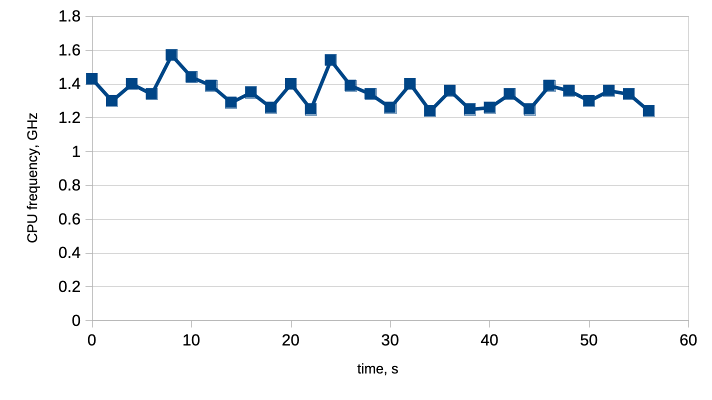
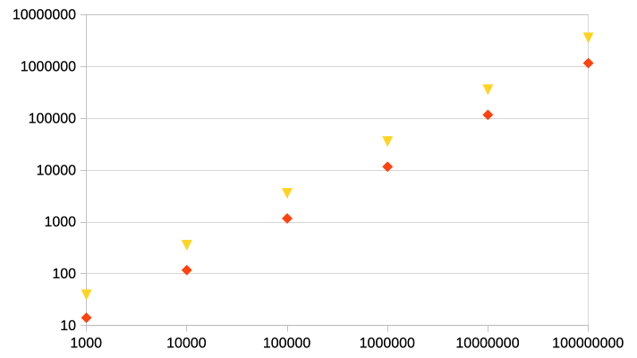

Сравнение скорости работы кольцевого двусвязного списка на массивах и классического списка
===

Данные измерения проводились на Macbook Air с 8-ядерным процессором Apple M1, с 16 GB оперативной памяти и операционной системой Sonoma 14.4.

Для сравнения был отключен верификатор у обоих списков, а также выключен ```debug_mode```, и добавлена оптимизация ```-o3```.

Общий список флагов выглядел так:
```
-O3 -DNDEBUG -fomit-frame-pointer \
-Wall -Wextra -Werror \
-Wcast-align -Wcast-qual -Wconversion \
-Wfloat-equal -Wformat-security -Wformat=2 \
-Wnull-dereference -Winit-self \
-Wshadow -Wstrict-overflow=2 \
-Wswitch-default -Wswitch-enum \
-Wundef -Wunused -Wvla
```

Замеры времени происходили с помощью вызова функции ```getrusage``` из библиотеки ```<sys/resource.h>```в начале и в конце выполняемой серии операций. Серии операций состояли из последовательных вставок и удалений в количестве от $10^3$ до $10^8$ раз.

Дополнительно был выставлен максимальный приоритет задачи (QoS), чтобы процесс выполнялся на "ядрах производительности" (Perfomance Cores). Приоритет выставлялся с помощью команды ```pthread_set_qos_class_self_np (QOS_CLASS_USER_INTERACTIVE, 0);``` из библиотеки ```pthread.h```.

Время выполнения вычислялось следующим образом:

```
...

#include <sys/resource.h>
struct rusage usage;

...

for (int i = 3; i < 9; i++)
{
    getrusage(RUSAGE_SELF, &usage);
    struct timeval begin = usage.ru_utime;
    long long start_time = begin.tv_usec + 1000000 * begin.tv_sec;

    ...

    // main loop here

    ...

    getrusage(RUSAGE_SELF, &usage);
    struct timeval end = usage.ru_utime;
    long long finish_time = end.tv_usec + 1000000 * end.tv_sec;
    
    printf("LIST: number of iterations = 10^%d, delta = %llu\n\n", i, finish_time - start_time);
}

```

Подобным образом измерялось время работы кольцевого списка и классического списка при $10^3$ - $10^8$ итерациях по 11 раз за запуск.

В каждом повторении теста сначала измерялось время работы классического списка, потом кольцевого.

На протяжении всего эксперимента работа сторонних приложений была сведена к минимуму, выполнение программы выполнялось одном ядре процессора, однако, вследствие встроенных оптимизаций, само ядро, на котором выполнялась задача, менялось.


На следующем графике представлена зависимость тактовой частоты процессора от времени:



Результаты измерений 2 - 11 повторения теста для классического списка представлены в следующей таблице:

n| 0       | 1       | 2       | 3       | 4       | 5       | 6       | 7       | 8       | 9       | 10      | average  |$\varepsilon$|
|---|---------|---------|---------|---------|---------|---------|---------|---------|---------|---------|---------|----------|---|
|$10^3$| 93      | 39      | 38      | 40      | 39      | 39      | 40      | 40      | 39      | 39      | 39      | 39.2 $\pm$ 0.2     |0.510 \%|
|$10^4$| 884     | 360     | 360     | 359     | 360     | 360     | 360     | 362     | 359     | 360     | 359     | 359.9 $\pm$ 0.3    |0.077 \%|
|$10^5$| 7388    | 3588    | 3588    | 3595    | 3588    | 3589    | 3586    | 3618    | 3588    | 3587    | 3587    | 3591.4 $\pm$ 3.0   |0.085 \%|
|$10^6$| 45869   | 35891   | 35905   | 35889   | 35881   | 35868   | 35874   | 36050   | 35885   | 35876   | 35888   | 35900.7 $\pm$ 16.9 |0.047 \%|
|$10^7$| 358866  | 359322  | 358785  | 359156  | 358952  | 359391  | 359031  | 358884  | 359500  | 359073  | 359147  | 359124.1 $\pm$ 72.0 |0.020 \%|
|$10^8$| 3592908 | 3590347 | 3590443 | 3589402 | 3590367 | 3590237 | 3590191 | 3590379 | 3589702 | 3589906 | 3590473 | 3590144.7 $\pm$ 113.4 |0.003 \%|

Результаты измерений 2 - 11 повторения теста для кольцевого списка на массивах представлены в следующей таблице:

| n       | 0       | 1       | 2       | 3       | 4       | 5       | 6       | 7       | 8       | 9       | 10      | average   |$\varepsilon$|
|---------|---------|---------|---------|---------|---------|---------|---------|---------|---------|---------|---------|-----------|---|
| $10^3$      | 14      | 14      | 14      | 14      | 15      | 14      | 14      | 14      | 14      | 14      | 15      | 14.2 $\pm$ 0.1      |0.939 \%|
| $10^4$     | 117     | 117     | 118     | 118     | 117     | 118     | 118     | 119     | 117     | 118     | 118     | 117.8 $\pm$ 0.2     |0.170 \%|
| $10^5$    | 1171    | 1171    | 1171    | 1168    | 1171    | 1171    | 1171    | 1183    | 1166    | 1165    | 1171    | 1170.8 $\pm$ 1.5    |0.132 \%|
| $10^6$   | 11684   | 11678   | 11678   | 11684   | 11665   | 11667   | 11664   | 11827   | 11673   | 11694   | 11670   | 11689.6 $\pm$ 15.7   |0.134 \%|
| $10^7$  | 116765  | 116859  | 116859  | 116760  | 116796  | 122554  | 116750  | 116807  | 116794  | 116785  | 117168  | 117432.8 $\pm$ 603.6  |0.514 \%|
| $10^8$ | 1168505 | 1168483 | 1168483 | 1169359 | 1168790 | 1168547 | 1168389 | 1168560 | 1168966 | 1168550 | 1168812 | 1168796.1 $\pm$ 119.8 |0.010 \%|

В таблице указана зависимость времени выполнения (в мкс) от количества итераций.

В силу своей малости по сравнению с измеряемыми величинами, погрешности не повлияли на результат.

Значения эксперимента первого цикла в дальнейшем не рассматривались, поскольку значения времени для классического списка (который тестировался первым) значительно отличались при первых измерения по сравнению с остальными. Для кольцевого списка, значения не расходились. Данное явление, возможно, обусловлено подгрузкой используемых данных в кэш. 

График построенный по данным из таблицы (красные точки - кольцевой список на массивах, жёлтые - классический список):



Разница в длительности работы вычислялась с помощью силовой регрессии (power regression).

f(x) - для классического списка

g(x) - для кольцевого списка на массивах

$$
    y = kx^\alpha
$$

Для кольцевого списка $k = 0.039$.

Для классического списка $k = 0.014$.

Смысл величины $k$ состоит в том, что она обратна скорости, т.е. кольцевой список на массивах, как и ожидалось, работает быстрее классического списка примерно в 2,9 раза.


